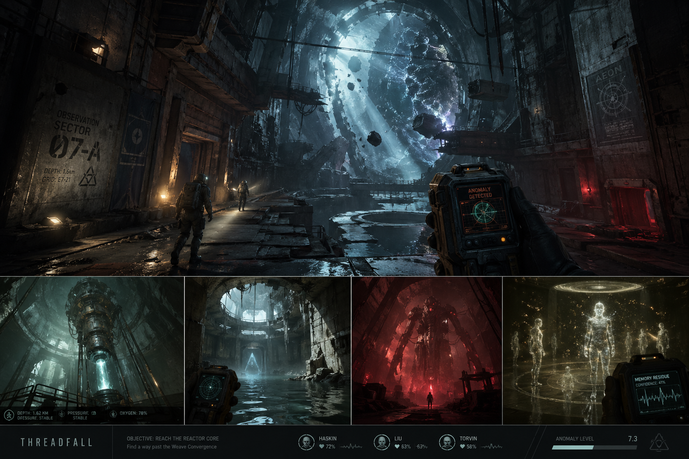
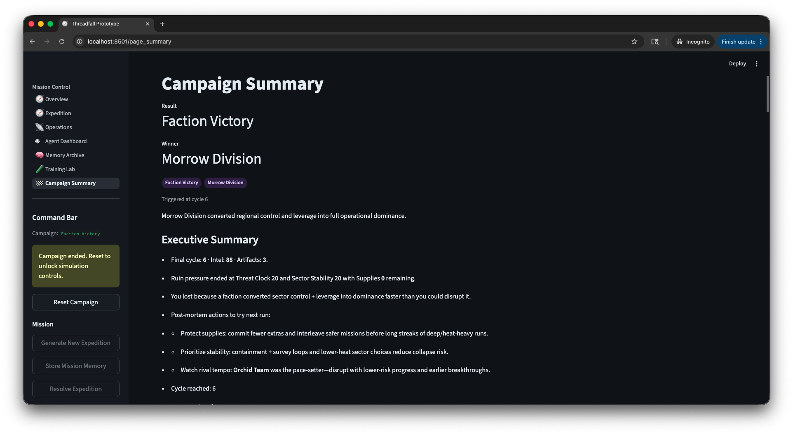
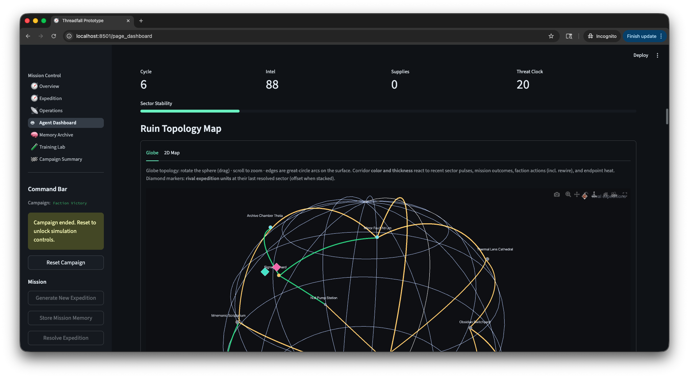
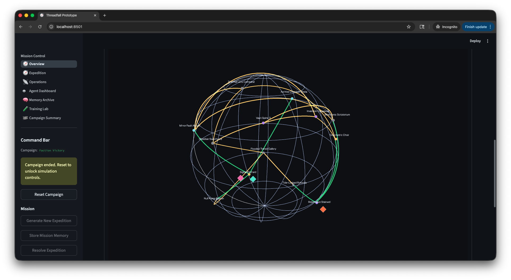
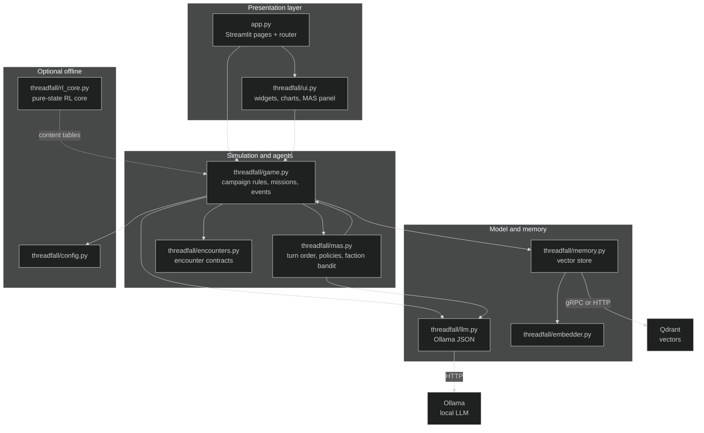
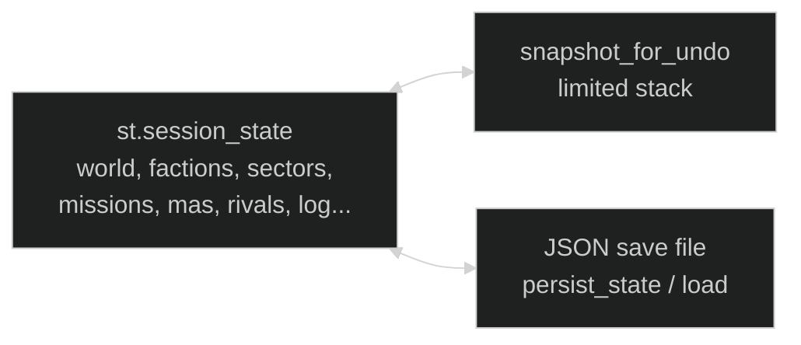
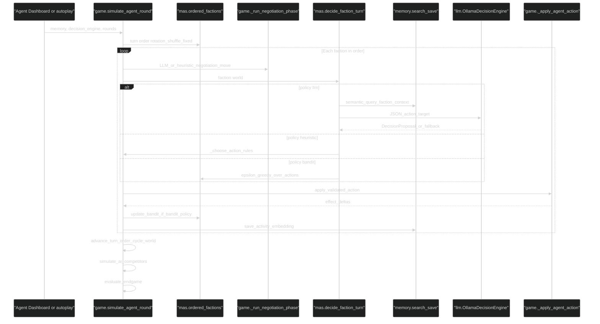
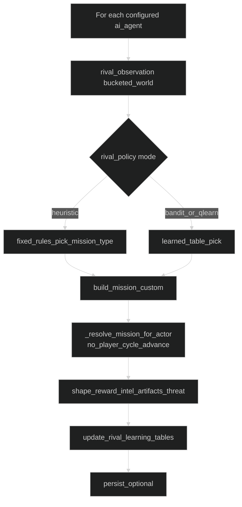
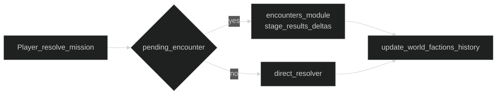

# Threadfall Prototype

## Game objective

The **main technology objective** of Threadfall is to field and study **ML agents** in a single, persistent campaign: **multi-agent scheduling (MAS)** for autonomous factions (heuristic, **ε-greedy bandit**, or local **LLM** JSON policies), **negotiation agents** (structured moves + optional Ollama), **vector-memory–grounded** decisions, **rival units** with tabular **bandit / Q-style** learning, and **end-to-end autonomous stacks** (autoplay + optional **ML swarm** runs) that advance the world without hand-authored play. The ruin expedition is the **playable substrate** those agents stress-test—not the other way around.

**Campaign setting (what the sim is “about”)**

- A **campaign-level ruin expedition**: your squad moves through contested sectors while AI factions and rival expedition units fight for the same space. Each cycle the world tracks **intel**, **supplies**, **threat**, **global sector stability**, **sector heat and control**, and **artifacts** in inventory.

**Win / loss goals inside that substrate** (same engine drives human and autonomous play)

- **Primary player goal:** reach a **decisive breakthrough** before anyone else locks the ruin—**campaign intel ≥ 200** and **8 recovered artifacts** in inventory (`Player Victory`). Rival ML units can hit parallel thresholds first (`Rival Victory`).
- **Operational pressure:** resolve expeditions and counter-missions without **terminal threat** or **collapsed stability**, and without **hub collapse under stacked crises** (`Player Defeat`). A faction can **win politically** via sector control + leverage; a long run without a breakthrough can end in **Stalemate** (see [Endgame Conditions](#endgame-conditions)).

**What success means for this prototype**

- You can **observe, compare, and iterate** on agent policies under pressure—logging, dashboards, Training Lab batches, and optional local **Ollama**—inside one coherent **save-backed** simulation, not only a static rules demo.




## Architecture

Threadfall is a **Streamlit monolith**: almost all runtime state lives in `st.session_state`, with periodic JSON snapshots to disk (`SETTINGS.save_path`). The diagrams below are the mental model for modules and external services.

> **Viewing diagrams:** Fenced blocks use [Mermaid](https://mermaid.js.org/) (`flowchart`, `sequenceDiagram`). They render on GitHub and in Markdown previews that enable Mermaid; if you only see source, switch viewer or paste the block into the [Mermaid Live Editor](https://mermaid.live). Charts set an explicit **dark** theme so text and edges stay visible on GitHub’s canvas (light-on-light is a common default failure mode).







### Component diagram



### Session state and persistence



Key ideas:

- **Single source of truth** during a session: `st.session_state` mutated by `threadfall/game.py` helpers.
- **Undo** snapshots a subset of keys (including `mas`) before risky ticks.
- **Save file** mirrors the persistent slice of that state so campaigns survive restarts.

### How AI agents behave

There are **three distinct agent-like loops** in the prototype:

| Agent class | Role | Decision mechanism | When it runs |
|-------------|------|-------------------|--------------|
| **Factions** | Autonomous ruin actors; negotiate then act on sectors / rivals / hub | **MAS policy** per faction: Ollama JSON (`llm`), rules (`heuristic`), or ε-greedy **bandit** over expedition actions with **factor-weighted** rewards from effect deltas | `simulate_agent_round` (Agent Dashboard, autoplay, etc.) |
| **Rival expedition units** | Optional “other squads” competing on missions | `rival_policy` mode: **heuristic**, **bandit**, or **Q-learning** over abstract mission types; observation is bucketed world state; reward shaped from mission outcome | After each full faction round (`simulate_ai_competitors`) and from **Training Lab** batch steps |
| **Player squad** | Human-driven expedition | UI choices; mission **resolution** applies deterministic rules + encounter payloads | Expedition page / command bar |

#### Faction autonomous cycle (MAS + memory + LLM)



**Negotiation** always runs before the action for that faction: a partner is chosen, an LLM (or fallback) proposes `threaten | bargain | align | deceive`, then the expedition action executes.

**Bandit (faction)** learns only when the faction’s MAS policy is `bandit`: after each step it updates running mean Q-values keyed by a coarse **observation fingerprint** (world buckets + pressure + leverage + rough sector control).

#### Rival units (Training Lab / tail of faction round)



Rivals **do not** share the faction MAS layer; they use `st.session_state["rival_policy"]`, `rival_bandit`, and `rival_q` (see Training Lab UI).

### Player expedition resolution (high level)



---

## Run With Docker

```bash
docker compose up --build
```

Then open:

```text
http://localhost:8501
```

This is the easiest portable path, but on macOS it should be treated as CPU-first for the app runtime.

## Run (Host App + Auto Qdrant)

If you want a one-command launcher that ensures Qdrant is up first:

```bash
chmod +x run.sh
./run.sh
```

This launches the Streamlit app on `http://localhost:8501` and starts `qdrant` via Docker Compose if it is not already running.

## Rival Learning (In-App) + Optional RL Training

- **In-app learning (recommended first)**: open `Training Lab` in the left navigation.
  - Modes: `heuristic`, `bandit`, `qlearn`
  - Use “Run Training” to advance rival expeditions and update the learned tables.

- **Optional RL(B) scaffolding (offline training)**:
  1. Install extra deps:

```bash
pip install -r requirements-rl.txt
```

  2. Train a starter policy (placeholder env for now):

```bash
python scripts/train_sb3.py --steps 200000
```

The Gym env in `rl/threadfall_env.py` is now backed by a **pure-state transition core** in `threadfall/rl_core.py` (no `st.session_state`). This is the baseline for “real RL” training.

## Run With Apple GPU on macOS

1. Create a virtual environment

```bash
python3 -m venv .venv
source .venv/bin/activate
pip install -r requirements.txt
```

2. Start Qdrant in Docker

```bash
docker compose up qdrant
```

3. Run the app natively with MPS enabled

```bash
THREADFALL_EMBED_DEVICE=mps streamlit run app.py
```

If MPS is unavailable, the app automatically falls back to CPU.

## Current Prototype Scope

This is a systems-first prototype, not a real-time 3D game yet. It focuses on:

- mission generation
- anomaly logs
- vector memory retrieval
- autonomous faction turns
- agent-to-agent negotiation
- live agent activity tracking
- persistent campaign state
- sector control
- dynamic world events
- queued counter-missions
- local LLM-assisted faction decisions
- bounded autoplay simulation on the dashboard
- explicit player/faction endgame conditions
- final campaign summary screen
- timeline charts for world pressure, faction leverage, and sector control
- a path to hybrid AI features

## Current Gameplay Loop

1. Generate or inspect the current expedition in `Expedition`.
2. Store the mission memory if you want it indexed in Qdrant.
3. Resolve the expedition to change the campaign state.
4. Open `Operations` to inspect faction pressure, artifacts, and history.
5. Open `Agent Dashboard` to run autonomous faction cycles and observe agent reasoning, effects, and live world events.
6. Watch `Operations` for sector control shifts and queued counter-missions.
7. Use `Start Autoplay` in `Agent Dashboard` to advance the simulation over multiple timed ticks.
8. Inspect the `Negotiation Feed` to see how factions bargain, threaten, align, or deceive before acting.
9. When the campaign ends, open `Campaign Summary` to review the winner, final sector control, and campaign outcome.
10. Use the timeline charts on `Agent Dashboard` and `Campaign Summary` to understand how the campaign changed over time.

## Endgame Conditions

The campaign now ends when one of these conditions is met:

- `Player Victory`: campaign **intel ≥ 200** and **at least 8 artifacts** in player inventory
- `Rival Victory`: a configured rival unit reaches **intel ≥ 200** and **artifacts ≥ 8** before the player
- `Player Defeat`: the ruin enters terminal escalation or the expedition hub collapses under simultaneous crises
- `Faction Victory`: a single faction gains strong sector control and enough leverage to lock in dominance
- `Stalemate`: the campaign runs too long without a decisive breakthrough

## Local Decision Model

Faction decisions now try to use local Ollama inference through `llama3.2:latest` by default.
The model proposes an action, target, reasoning, and confidence. The Python game layer validates the result against allowed actions and targets before applying it. If the model is unavailable or returns invalid output, the game falls back to the deterministic heuristic agent.

Useful environment variables:

- `THREADFALL_OLLAMA_ENABLED=true`
- `THREADFALL_OLLAMA_URL=http://127.0.0.1:11434`
- `THREADFALL_OLLAMA_MODEL=llama3.2:latest`
- `THREADFALL_OLLAMA_EMBED_MODEL=nomic-embed-text:latest`
- `THREADFALL_OLLAMA_TIMEOUT=20`

## Next Good Steps

- add faction agents and persistent world state
- add artifact inventory and progression
- store richer event memories in Qdrant
- swap the placeholder embedder for a local model when ready
