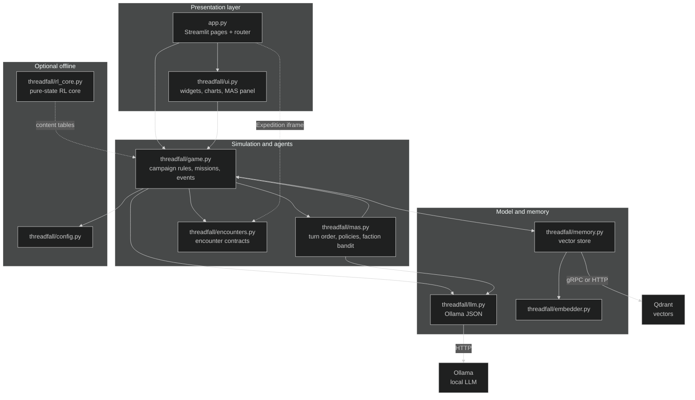
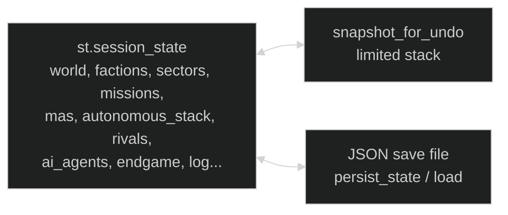
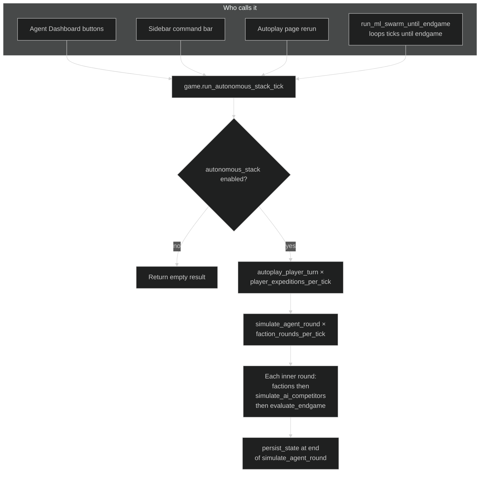
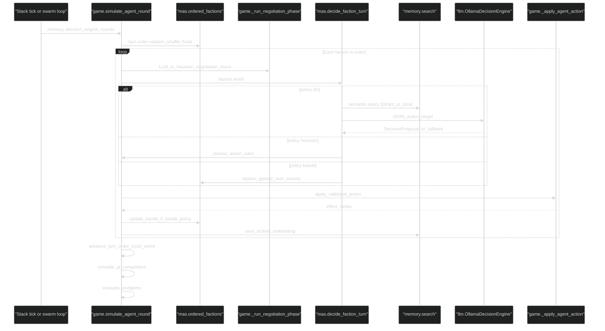
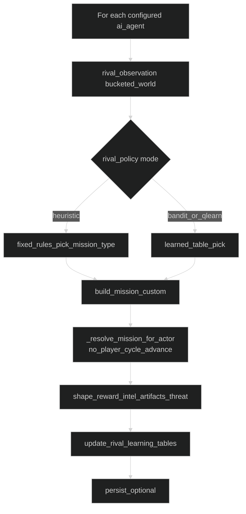
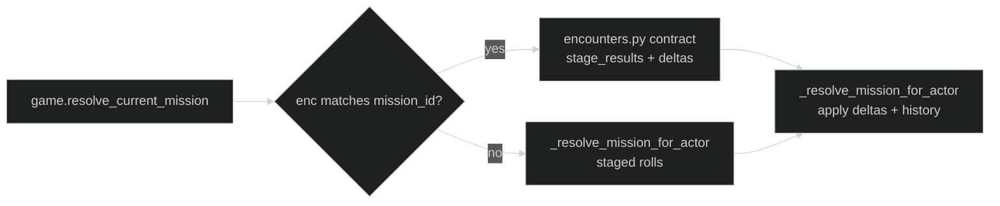

# Threadfall Prototype

## Game objective

The **main technology objective** of Threadfall is to field and study **ML agents** in a single, persistent campaign: **multi-agent scheduling (MAS)** for autonomous factions (heuristic, **ε-greedy bandit**, or local **LLM** JSON policies), **negotiation agents** (structured moves + optional Ollama), **vector-memory–grounded** decisions, **rival units** with tabular **bandit / Q-style** learning, and **end-to-end autonomous stacks** (autoplay + optional **ML swarm** runs) that advance the world without hand-authored play. The ruin expedition is the **playable substrate** those agents stress-test—not the other way around.

**Campaign setting (what the sim is “about”)**

- A **campaign-level ruin expedition**: your squad moves through contested sectors while AI factions and rival expedition units fight for the same space. Each cycle the world tracks **intel**, **supplies**, **threat**, **global sector stability**, **sector heat and control**, and **artifacts** in inventory.

**Win / loss goals inside that substrate** (same engine drives human and autonomous play)

- **Primary player goal:** reach a **decisive breakthrough** before anyone else locks the ruin—**campaign intel ≥ 200** and **8 recovered artifacts** in inventory (`Player Victory`). Rival ML units can hit parallel thresholds first (`Rival Victory`).
- **Operational pressure:** resolve expeditions and counter-missions without **terminal threat** or **collapsed stability**, and without **hub collapse under stacked crises** (`Player Defeat`). A faction can **win politically** via sector control + leverage; a long run without a breakthrough can end in **Stalemate** (see [Endgame Conditions](#endgame-conditions)).

**What success means for this prototype**

- You can **observe, compare, and iterate** on agent policies under pressure—logging, dashboards, Training Lab batches, and optional local **Ollama**—inside one coherent **save-backed** simulation, not only a static rules demo.


## Architecture

Threadfall is a **Streamlit monolith**: almost all runtime state lives in `st.session_state`, with periodic JSON snapshots to disk (`SETTINGS.save_path` from `threadfall/config.py`). The **authoritative simulation** lives in `threadfall/game.py`; `threadfall/ui.py` and `app.py` only drive widgets and routing.

**Runtime entry points (current design)**

- **Human path:** Expedition / Overview / Operations pages → `resolve_current_mission` or manual stack buttons.
- **Autonomous path:** `run_autonomous_stack_tick` in `game.py` (Agent Dashboard, sidebar command bar, autoplay reruns). It runs **N × `autoplay_player_turn`** (player mission resolution, encounter UI skipped when autopilot clears `pending_encounter`) then **M × `simulate_agent_round`** inner rounds (each: all factions negotiate + act, then `simulate_ai_competitors`, then `evaluate_endgame`). **`run_ml_swarm_until_endgame`** loops that stack until endgame or a tick cap (optional throughput + optional all-faction bandit preset).
- **Persistence:** `persist_state()` writes the snapshot dict after many mutations; `snapshot_for_undo` captures a subset of keys for undo (stack capped).

Security reviews are filed under [`security-audits/`](security-audits/).

> **Viewing diagrams:** Fenced blocks use [Mermaid](https://mermaid.js.org/) (`flowchart`, `sequenceDiagram`). They render on GitHub and in Markdown previews that enable Mermaid; if you only see source, switch viewer or paste the block into the [Mermaid Live Editor](https://mermaid.live). Charts set an explicit **dark** theme so text and edges stay visible on GitHub’s canvas (light-on-light is a common default failure mode).


### Component diagram



`run_autonomous_stack_tick` / `run_ml_swarm_until_endgame` live in **`game.py`** (same subgraph as `GAME`); the diagram does not duplicate them as separate boxes to avoid clutter.

### Session state and persistence



Key ideas:

- **Single source of truth** during a session: `st.session_state` mutated by `threadfall/game.py` helpers.
- **Undo** snapshots a subset of keys (including `mas`, `autonomous_stack`, `current_mission`, autoplay flags) before risky ticks; stack depth is capped in code.
- **Save file** mirrors the persistent slice (`persist_state` payload) so campaigns survive restarts; includes `rival_policy` / `rival_bandit` / `rival_q` for Training Lab continuity.

### How AI agents behave

There are **three distinct agent-like loops** in the prototype:

| Agent class | Role | Decision mechanism | When it runs |
|-------------|------|-------------------|--------------|
| **Factions** | Autonomous ruin actors; negotiate then act on sectors / rivals / hub | **MAS policy** per faction: Ollama JSON (`llm`), rules (`heuristic`), or ε-greedy **bandit** over expedition actions with **factor-weighted** rewards from effect deltas | `simulate_agent_round` (stack tick, autoplay, swarm inner loop) |
| **Rival expedition units** | Optional “other squads” competing on missions | `rival_policy` mode: **heuristic**, **bandit**, or **Q-learning** over abstract mission types; observation is bucketed world state; reward shaped from mission outcome | End of each inner `simulate_agent_round` pass (`simulate_ai_competitors`) and from **Training Lab** batch steps |
| **Player squad** | Human or autopilot expedition | UI + `mission_commit_supplies`; **`resolve_current_mission`** applies deterministic rules + optional **encounter deltas** (`pending_encounter`) | Expedition page / command bar / `autoplay_player_turn` |

#### Autonomous stack (one tick)



#### Faction autonomous cycle (MAS + memory + LLM)



**Negotiation** always runs before the action for that faction: a partner is chosen, an LLM (or fallback) proposes `threaten | bargain | align | deceive`, then the expedition action executes.

**Bandit (faction)** learns only when the faction’s MAS policy is `bandit`: after each step it updates running mean Q-values keyed by a coarse **observation fingerprint** (world buckets + pressure + leverage + rough sector control).

**Note:** Inside `simulate_agent_round`, **`simulate_ai_competitors`** and **`evaluate_endgame`** run **after each inner round** (each pass over all factions). The diagram collapses that to one visual step per outer `simulate_agent_round` invocation. **`persist_state`** runs at the end of `simulate_agent_round` (not shown in the sequence).

#### Rival units (Training Lab / tail of faction round)



Rivals **do not** share the faction MAS layer; they use `st.session_state["rival_policy"]`, `rival_bandit`, and `rival_q` (see Training Lab UI).

### Player expedition resolution (high level)



Encounter iframes on the Expedition page can post results back via query param `enc` (decoded in `app.py` into `pending_encounter` before resolve).

---

## Run With Docker

```bash
docker compose up --build
```

Then open:

```text
http://localhost:8501
```

This is the easiest portable path, but on macOS it should be treated as CPU-first for the app runtime.

## Run (Host App + Auto Qdrant)

If you want a one-command launcher that ensures Qdrant is up first:

```bash
chmod +x run.sh
./run.sh
```

This launches the Streamlit app on `http://localhost:8501` and starts `qdrant` via Docker Compose if it is not already running.

## Rival Learning (In-App) + Optional RL Training

- **In-app learning (recommended first)**: open `Training Lab` in the left navigation.
  - Modes: `heuristic`, `bandit`, `qlearn`
  - Use “Run Training” to advance rival expeditions and update the learned tables.

- **Optional RL(B) scaffolding (offline training)**:
  1. Install extra deps:

```bash
pip install -r requirements-rl.txt
```

  2. Train a starter policy (placeholder env for now):

```bash
python scripts/train_sb3.py --steps 200000
```

The Gym env in `rl/threadfall_env.py` is now backed by a **pure-state transition core** in `threadfall/rl_core.py` (no `st.session_state`). This is the baseline for “real RL” training.

## Run With Apple GPU on macOS

1. Create a virtual environment

```bash
python3 -m venv .venv
source .venv/bin/activate
pip install -r requirements.txt
```

2. Start Qdrant in Docker

```bash
docker compose up qdrant
```

3. Run the app natively with MPS enabled

```bash
THREADFALL_EMBED_DEVICE=mps streamlit run app.py
```

If MPS is unavailable, the app automatically falls back to CPU.

## Current Prototype Scope

This is a systems-first prototype, not a real-time 3D game yet. It focuses on:

- mission generation and expedition encounters (HTML mini-games + `?enc=` handoff)
- anomaly logs and dynamic world events
- vector memory retrieval (Qdrant or local fallback) and embeddings (Ollama or hash embedder)
- **MAS** autonomous faction turns with per-faction **heuristic / bandit / LLM** policies
- agent-to-agent negotiation (structured JSON + optional Ollama)
- **Autonomous stack** (`run_autonomous_stack_tick`) and **ML swarm** (`run_ml_swarm_until_endgame`) on the Agent Dashboard and sidebar
- live agent activity tracking, topology maps, and timeline charts
- persistent campaign state (`persist_state` / load) including rivals and `autonomous_stack`
- sector control, queued counter-missions, and explicit endgame rules
- Training Lab rival learning (`heuristic` / `bandit` / `qlearn`) and optional **SB3** scaffolding (`rl/`, `scripts/`)
- periodic **security audit** notes under `security-audits/`

## Current Gameplay Loop

1. Generate or inspect the current expedition on **Expedition** (Overview has squad setup and map).
2. Store the mission memory if you want it indexed in Qdrant.
3. Resolve the expedition (or run encounters first) to change campaign state.
4. Open **Operations** to inspect faction pressure, artifacts, and history.
5. Open **Agent Dashboard** to tune **Autonomous ML stack**, run **1 / 5 cycles**, **Start Autoplay**, or **ML swarm to endgame**; use the **sidebar** for the same stack controls.
6. Watch **Operations** for sector control shifts and queued counter-missions.
7. Use **MAS** panel (sidebar or dedicated UI) to inspect per-faction policies and bandit factors.
8. Inspect the **Negotiation Feed** for `threaten | bargain | align | deceive` moves before faction actions.
9. When the campaign ends, open **Campaign Summary** for outcome and charts.
10. Use **Training Lab** for rival batch learning independent of a live campaign tick.

## Endgame Conditions

The campaign now ends when one of these conditions is met:

- `Player Victory`: campaign **intel ≥ 200** and **at least 8 artifacts** in player inventory
- `Rival Victory`: a configured rival unit reaches **intel ≥ 200** and **artifacts ≥ 8** before the player
- `Player Defeat` (**The Ruin**): **`threat_clock` ≥ 100** or **`sector_stability` ≤ 0**
- `Player Defeat` (**Rival Factions**): **`supplies` ≤ 0** and **≥ 3** queued `counter_missions`
- `Faction Victory`: leading faction holds **≥ 3 sectors** (per `FACTIONS` count) and that faction’s **`leverage` ≥ 60**
- `Stalemate`: **`cycle` ≥ 80** with none of the above firing first

## Local Decision Model

Faction decisions now try to use local Ollama inference through `llama3.2:latest` by default.
The model proposes an action, target, reasoning, and confidence. The Python game layer validates the result against allowed actions and targets before applying it. If the model is unavailable or returns invalid output, the game falls back to the deterministic heuristic agent.

Useful environment variables:

- `THREADFALL_OLLAMA_ENABLED=true`
- `THREADFALL_OLLAMA_URL=http://127.0.0.1:11434`
- `THREADFALL_OLLAMA_MODEL=llama3.2:latest`
- `THREADFALL_OLLAMA_EMBED_MODEL=nomic-embed-text:latest`
- `THREADFALL_OLLAMA_TIMEOUT=20`

## Next Good Steps

- signed or server-stored encounter payloads (replace trust-in-URL `enc` for integrity)
- tighter pins for Docker base images and dependency lockfiles for reproducible deploys
- richer event + mission schemas in Qdrant payloads for analytics
- optional SB3 env parity with live `game.py` rules where drift matters
